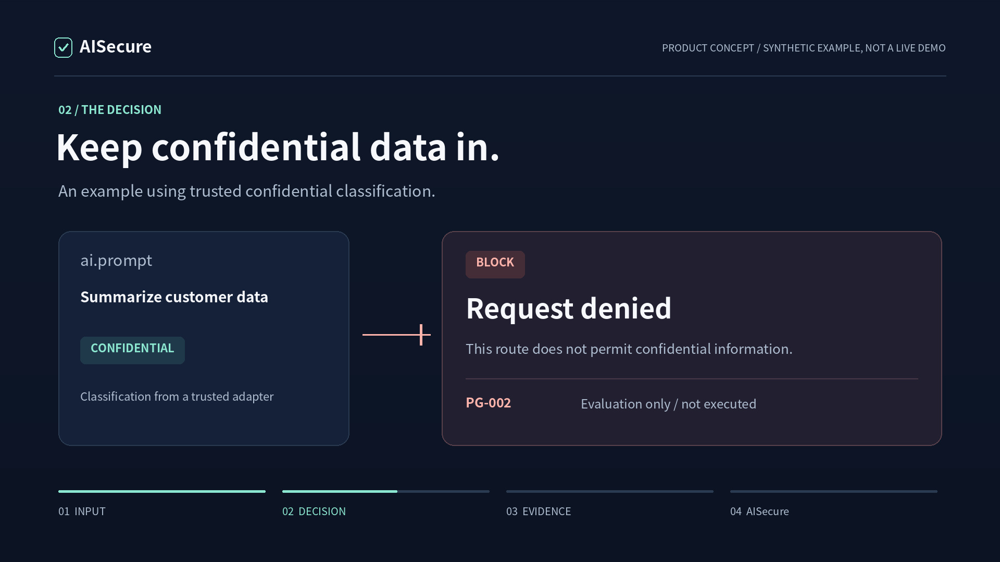

# AISecure — inspect a document before sending it

Start with an editable synthetic spreadsheet, inspect it locally, then save a JSON
report with the decision, reasons and coverage. A **review** result is a completed
inspection, not a failure to use the app. No provider account or API key is needed.

```sh
python3 -m venv .venv
. .venv/bin/activate
python -m pip install '.[control]'
python -m aisecure.control --demo
```

Python 3.11+. Run from this repository; on Windows activate `.venv\Scripts\activate`.
Open the printed URL, click **送信せずに検査**, inspect the **保留** result for the
editable confidential sample, then **検査結果をJSONで保存**. The UI is Japanese.
The real scanner runs locally; the demo does not send to an AI or change a VPN.
Stop with Ctrl+C. Demo history is deleted; downloaded reports remain on your device.

**We measured our own miss rate instead of claiming coverage.** On a 60-case
labelled corpus the shipped patterns reach recall 0.30, and there are categories
they detect zero times — mynumber, credit cards, landlines, and every major
vendor token format: [detection measurement](docs/security/DETECTION_MEASUREMENT.md).
Read that before trusting a "no findings" result.

[First success and recovery](docs/FIRST_PROOF.md) ·
[Threat model](docs/security/THREAT_MODEL.md) ·
[In-page stop for AI sites](docs/operations/BROWSER_ENFORCEMENT.md) ·
[CLI / Python integration and compatibility](docs/operations/DOCUMENT_CONTRACT.md) ·
[Acceptance](docs/quality/acceptance.md) · [Local verification](docs/quality/skill-review.md)

This working tree is 0.4.0a3.dev0 (unreleased), based on 0.4.0a2.
The new document report interface is experimental. Pin a reviewed revision when integrating. No OCR, antivirus, whole-device
DLP or production certification is claimed. Local workers are not network sandboxes.

---

## Integrated control extension — 0.4.0a2

The `0.4.0a2` control workbench covers document preflight, VPN posture and
narrowly approved response, cross-source analytics, and compact encrypted audit
metadata. It does **not** provide blanket browser DLP or proven VPN containment.
The browser companion is an explicit preflight checker only.

Verified on Ubuntu and macOS across Python 3.11, 3.13 and 3.14, against the
declared `pypdf>=6.19`: 454 tests, no failures and no skips in the required
quality job. That is an automated synthetic result, not live enterprise
validation — the gates below still stand.

```sh
python -m pip install '.[control]'
python -m aisecure.control --demo
```

[日本語の起動・運用手順](docs/operations/CONTROL_ALPHA.md) ·
[All requirements and remaining gates](docs/operations/CONTROL_SCOPE.md) ·
[Recorded validation](docs/operations/CONTROL_VALIDATION.json)

The source changes are not a production certification. Read the remaining gates,
especially actual browser enforcement, image/OCR coverage, device validation,
and deployment-specific validation. The older workbench below is retained.

---

# AI Secure

**Inspect before sending. Keep the reasons and delivery state together. A local workbench for developers.**

[Website](https://forifor.github.io/AISecure/) · [18-second product concept](https://forifor.github.io/AISecure/media/product-film-en.mp4) · [Workbench guide](docs/operations/WORKBENCH.md) · [Task and validation matrix](docs/operations/TASK_MATRIX.md)

[](https://forifor.github.io/AISecure/media/product-film-en.mp4)

## 0.4.0a1: try the preflight workbench

```sh
python3 -m venv .venv
. .venv/bin/activate
python -m pip install '.[workbench]'
python -m aisecure.workbench --demo
```

Run from the repository root. On Windows activate `.venv\Scripts\activate`.
The workbench currently uses Japanese copy. Its demo sends nothing to an external AI and deletes temporary state when stopped.
Live OpenAI delivery is an explicit administrator opt-in, requiring a short-lived classification signature bound to the exact input,
request ID, model, destination and policy. The service never holds the classification private key.

This is an alpha for managed local evaluation, **not** host-wide DLP, VPN containment or a finished enterprise SSO service.
Read-only FortiOS collection, supplied inventory/advisory assessment, DLP metadata ingestion and manifest drift checks are included.
Vendor-specific enforcement, real-device validation, retention operations and independent security review remain deployment gates.
See the [runbook](docs/operations/RUNBOOK.md). The product film is a concept, not live-enforcement evidence.

---

## Existing log triage and response foundation

# AI Secure

**Stop ranking alerts by CVSS. Correlate exposure, privilege, and behaviour instead — and measure what that costs you in false positives.**

A local-first security triage and response gateway that links an internet-facing unpatched gateway, a privileged login that fails its own conditions, and a burst of sensitive file reads into **one reviewable case with its evidence attached**.

[](https://github.com/FORIFOR/AISecure/actions/workflows/test.yml)
[](LICENSE)
[](pyproject.toml)
[](pyproject.toml)

[Reachmade Lab product page](https://reachmade.com/products/#aisecure) · [日本語 README](README.ja.md) · [How to tune it](docs/TUNING.md) · [Log connectors](docs/CONNECTORS.md) · [Okta response adapter](docs/OKTA.md) · [Responder protocol](docs/RESPONDER.md) · [Signed approvals](docs/APPROVALS.md) · [Audit checkpoint sink](docs/AUDIT_SINK.md) · [Security review](docs/SECURITY_REVIEW.md)


</div>

## The number that started this project

Everyone ships a "user read 100+ files in 5 minutes" rule. Almost nobody publishes what it costs on normal traffic. So we measured ours, on 18.8 days and 85,509 events of synthetic-but-realistic business activity — nightly backups, analyst bursts, a migration day, a search-indexing service, a weekly antivirus sweep, an eDiscovery pull, a batch ETL job, approved vendor maintenance:

| Rule | Alerts | True positives | **False positives** |
|---|---:|---:|---:|
| `AS-003` bulk file access, on its own | 103 | 1 | **102** |
| `AS-004` correlation: exposed gateway **+** privileged login **+** bulk access | 1 | 1 | **0** |

Raising the threshold until the bulk rule goes quiet also stops it detecting the incident. We swept 21 threshold/window combinations to confirm it — every configuration with zero false positives also missed the planted breach.

**That asymmetry is the whole product thesis.** Volume alone is not a signal. A path is.

> Synthetic data. This is not a real-world false-positive rate — it is a rehearsal you re-run on your own logs. **[Read the write-up →](https://forifor.github.io/AISecure/writeup.html)** · [raw method & caveats](docs/TUNING.md)

## 🧪 Want to help test it? (2 minutes)

This is an early prototype and **the most useful thing right now is a second pair of eyes.** No security expertise needed.

**No install? [▶ Try it in your browser](https://forifor.github.io/AISecure/try.html)** — the real UI on synthetic data, then hit "Give 2-min feedback". That's the fastest way to help.

Prefer to run it for real:

```bash
git clone https://github.com/FORIFOR/AISecure.git && cd AISecure
python3 -m aisecure serve --demo   # opens a local, offline UI
```

Then click through the demo and tell us one thing that confused you, or whether the core idea (correlate the *path*, not the CVSS score) landed. **[Open a 2-minute feedback issue →](https://github.com/FORIFOR/AISecure/issues/new?template=tester-feedback.md)**

More hands-on? Two asks that would genuinely move this forward:
- **[Does the importer choke on your log format?](https://github.com/FORIFOR/AISecure/issues?q=is%3Aissue+label%3Aconnector)** — VPN / IdP / file-server logs. [Report a format →](https://github.com/FORIFOR/AISecure/issues/new?template=log-format.md)
- **[Is a normal-business pattern missing from the false-positive baseline?](https://github.com/FORIFOR/AISecure/issues?q=is%3Aissue+label%3Atester-wanted)** — the thing that makes the measured number honest.

The demo and analysis paths run locally and offline: no account, no telemetry,
and no data leaves your machine. The optional `execute` path sends only the
signed response metadata described in [the responder protocol](docs/RESPONDER.md)
to the responder URL you configure.

## The live protection path

The local integration path can now poll read-only exports continuously and, only
after explicit double approval, deliver a minimal signed response request to a
separate responder. The responder owns provider credentials and must verify the
post-action state; AISecure never runs shell commands or stores VPN/IdP
credentials.

The Okta path can also read the authenticated System Log directly over HTTPS
and combine it with the local asset/file-access sources. It keeps only the
allowlisted login metadata and records the API response hash as provenance.

```bash
# Poll changed CSV/JSONL exports and ingest a new evidence snapshot
python3 -m aisecure watch \
  --source generic-asset-csv=assets.csv \
  --source generic-auth-csv=auth.csv \
  --source generic-file-access-jsonl=access.jsonl

# Poll Okta directly (the token is read only from the environment)
OKTA_ACCESS_TOKEN="$TOKEN_FROM_SECRET_MANAGER" \
python3 -m aisecure --data-dir ./private-state watch-okta \
  --asset-source generic-asset-csv=assets.csv \
  --source generic-file-access-jsonl=access.jsonl \
  --okta-domain https://example.okta.com

# After reviewing the plan, deliver one explicitly double-approved action
AISECURE_WEBHOOK_SECRET='use-a-32-byte-secret-from-your-secret-store' \
python3 -m aisecure execute \
  --proposal-id P-... --snapshot-id S-... \
  --provider-target provider-session-42 \
  --webhook-url https://responder.example/aisecure \
  --allow-action revoke_session \
  --primary-operator operator-a --secondary-operator operator-b \
  --reason '証拠と業務影響を確認し、失効後の復旧担当を決めた' \
  --confirm 'EXECUTE REAL ACTION' \
  --second-confirm 'SECOND APPROVER CONFIRMED'
```

Add `--emergency-stop-file ./STOP` to either real-execution command when an
operator-managed local kill switch is required. If the file exists, or cannot
be checked, no provider request is sent.

Retain the audit-chain tip in a separately operated sink (the sink must store
the acknowledged values independently):

```bash
AISECURE_AUDIT_SINK_SECRET='use-a-different-32-byte-secret' \
python3 -m aisecure --data-dir ./private-state publish-checkpoint \
  --url https://audit-vault.example/checkpoints
```

See [the checkpoint sink protocol](docs/AUDIT_SINK.md).

See [the responder protocol](docs/RESPONDER.md) before connecting a real
control plane. The bundled browser demo remains synthetic and simulation-only.

For the first provider-specific path, `execute-okta` can clear all IdP
sessions for one operator-supplied Okta user ID and requires a matching
`user.session.clear` event before it reports `verified`. See [the Okta runbook](docs/OKTA.md).

## Quick start

Python 3.11+. The demo needs no pip install, API key, cloud account, or LLM.

```bash
git clone https://github.com/FORIFOR/AISecure.git && cd AISecure
python3 -m aisecure serve --demo
```

Open the `Open:` URL it prints. Binds to `127.0.0.1` only, with a fresh token per run.

For a controlled deployment that must encrypt stored evidence, install the
optional production dependency and provide the key from a secret manager. The
key is 32 bytes represented as 64 hexadecimal characters and is never written
to the data directory:

```bash
python3 -m pip install '.[production]'
export AISECURE_MASTER_KEY="$(openssl rand -hex 32)"
python3 -m aisecure --encrypted --data-dir ./private-state serve
```

<details>
<summary><b>Read your own logs, then measure the false positives</b></summary>

```bash
# 1. Import real logs — read-only, nothing is written back to the sources
python3 -m aisecure import \
  --source generic-asset-csv=assets.csv \
  --source generic-auth-csv=auth.csv \
  --source generic-file-access-jsonl=access.jsonl \
  --out snapshot.json --quality quality.json

# 2. Measure what a threshold costs on normal business activity
python3 -m aisecure baseline --days 5 --users 40 --out normal.json
python3 -m aisecure baseline --days 5 --users 40 --attack --out incident.json
python3 -m aisecure evaluate normal.json incident.json --sweep --out report.md

# 3. Run with the thresholds you chose — the change is written to the audit chain
python3 -m aisecure --rules rules.json serve
```

CSV and JSON Lines are mapped through a declarative profile that can only reference an allowlist of fields, so a profile cannot be written that imports file contents or credentials. [Connector reference →](docs/CONNECTORS.md)

</details>

## What it will not do

Written first, on purpose. A security tool that only lists its strengths is not telling you enough to trust it.

- **Limited provider control only.** `watch` still polls local CSV/JSONL exports. `watch-okta` reads only Okta System Log login metadata; it does not connect to a VPN or file server. `execute-okta` is a narrow, explicit Okta session-clear adapter; it accepts only a verified `00u...` user ID and requires a matching System Log event. Other providers still use the separately operated signed responder boundary.
- **No automatic enforcement.** Real delivery requires an explicit plan, two distinct approval labels, an allowlisted action, and a responder that returns verified state. The built-in simulation path changes nothing.
- **No leak confirmation.** "These files were read" and "this data left the building" are shown as different claims, because they are.
- **No LLM in the detection path.** Default mode is deterministic rules with template explanations. An optional local Ollama adapter writes *supplementary prose only*, gets no tools and no raw logs, and every claim it makes is checked against the evidence IDs before display.
- **Unknown is never "safe".** A field that could not be read stays `null` and is counted, rather than becoming `false`.

Read [SECURITY.md](SECURITY.md) for the threat model, [SECURITY_REVIEW.md](docs/SECURITY_REVIEW.md) for what adversarial testing found, and [SECURITY_CHECKLIST.md](docs/SECURITY_CHECKLIST.md) for an honest, item-by-item production-verification checklist (done / not-done / who must verify).

## How it is put together

```text
real logs (CSV/JSONL) ─→ connectors ─┐
                                     ├─→ validate + pseudonymise ─→ detect ←─ tunable thresholds
manual JSON snapshot ────────────────┘                              │
                                                                    ├─→ explain   (no authority)
                                                                    └─→ plan ─→ human approval ─→ simulate / verified response
                                              local store + HMAC audit chain ─→ loopback-only UI

synthetic normal traffic ─→ false-positive measurement ─→ thresholds
```

Detection, explanation, and the authority to act are separate modules with explicit contracts. The model that writes prose has no path to the module that proposes actions — not as a prompt instruction, but because it is not wired to it.

| | |
|---|---|
| **Pseudonymisation** | User, session, and file identifiers become keyed HMACs before they are stored. Never anonymisation — [we say so](docs/INPUT_SCHEMA.md). |
| **Evidence** | Every finding carries the event IDs it was built from, and separates *observed* from *hypothesis* from *unknown*. |
| **Audit** | Ingest, explain, plan, approve, simulate, and threshold changes go into a keyed hash chain. `publish-checkpoint` can send a signed tip to an independently operated HTTPS sink — [protocol](docs/AUDIT_SINK.md). |
| **Storage** | The default zero-install mode uses a local file key. `.[production]` plus `--encrypted` encrypts snapshot and audit fields with an external 32-byte key. |
| **Approval** | 5-minute expiry, typed confirmation, reason required, and exact target binding. Production mode can require two Ed25519 approvals from an external SSO/RBAC gateway. |
| **Safety** | Optional emergency-stop file fails closed before a webhook or Okta request. |
| **Tests** | 216 in the default environment (6 optional cryptography tests skipped); the production environment runs all 216. `python3 -m unittest discover -s tests -v` |

## Screenshots

| Triage | Threshold tuning |
|---|---|
|  |  |

The UI is fully bilingual — English by default, with a `日本語` toggle in the top bar. Finding text, plan wording, and parameter descriptions all switch language too.

## Status

**v0.3.0 — a local integration prototype, honestly labelled.** Useful today for studying detection logic, polling exported logs, directly reading Okta System Log login metadata, rehearsing a triage workflow, and testing a narrow Okta session-clear path. Encrypted storage, independent checkpoint publication, signed approval verification, and an emergency-stop boundary are available for controlled deployments. Real-organization deployment, real-log validation, external SSO/RBAC rollout, recovery exercises, and an independent security review are still required.

Not implemented: live collectors for providers other than Okta, KEV/vendor advisory matching, native SSO/RBAC, non-Okta provider responders, and recovery automation. Signed approvals are a verification boundary and require an external identity gateway; encrypted storage and external audit publication are integration capabilities, not proof that the deployment's key manager or sink is secure. A [self-review](docs/SECURITY_REVIEW.md) found and fixed four detection-evasion defects in the import boundary; it is not a third-party audit.

The next milestone is not more features. It is getting one organisation's real authentication, gateway, and file-access logs through the importer, and measuring the false-positive rate on a period where nothing happened.

## Background

Built in response to the September 2026 disclosure of unauthorised access to Japan's Government Solution Service, where a **Medium**-rated, already-published vulnerability was exploited before the patch was applied, and a maintenance account was used to read a large number of files. That is precisely the case a CVSS-ordered queue handles badly. [Sources and how each one shaped the design →](docs/SOURCES.md)

Nothing here reconstructs that incident. All bundled data is synthetic.

---

MIT licensed. Issues and PRs welcome — especially real-world log formats that the connectors mangle, and normal business patterns the false-positive baseline is missing.