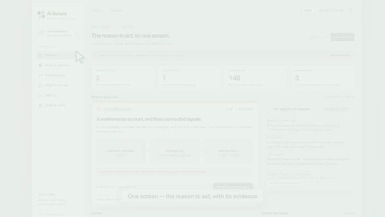
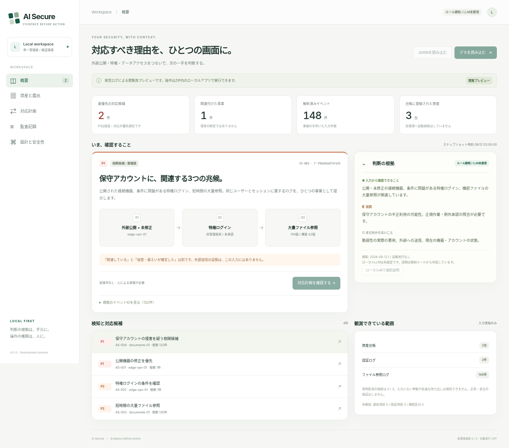
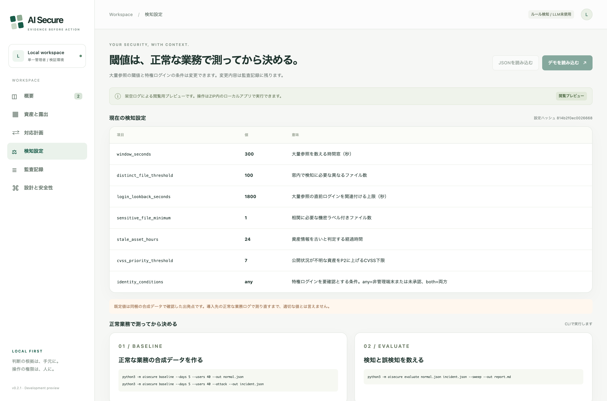

<div align="center">

# AI Secure

**Stop ranking alerts by CVSS. Correlate exposure, privilege, and behaviour instead — and measure what that costs you in false positives.**

A local-first security triage and response gateway that links an internet-facing unpatched gateway, a privileged login that fails its own conditions, and a burst of sensitive file reads into **one reviewable case with its evidence attached**.

[](https://github.com/FORIFOR/AISecure/actions/workflows/test.yml)
[](LICENSE)
[](pyproject.toml)
[](pyproject.toml)

[Reachmade Lab product page](https://reachmade.com/products/#aisecure) · [日本語 README](README.ja.md) · [How to tune it](docs/TUNING.md) · [Log connectors](docs/CONNECTORS.md) · [Responder protocol](docs/RESPONDER.md) · [Security review](docs/SECURITY_REVIEW.md)



</div>

## The number that started this project

Everyone ships a "user read 100+ files in 5 minutes" rule. Almost nobody publishes what it costs on normal traffic. So we measured ours, on 18.8 days and 85,509 events of synthetic-but-realistic business activity — nightly backups, analyst bursts, a migration day, a search-indexing service, a weekly antivirus sweep, an eDiscovery pull, a batch ETL job, approved vendor maintenance:

| Rule | Alerts | True positives | **False positives** |
|---|---:|---:|---:|
| `AS-003` bulk file access, on its own | 103 | 1 | **102** |
| `AS-004` correlation: exposed gateway **+** privileged login **+** bulk access | 1 | 1 | **0** |

Raising the threshold until the bulk rule goes quiet also stops it detecting the incident. We swept 21 threshold/window combinations to confirm it — every configuration with zero false positives also missed the planted breach.

**That asymmetry is the whole product thesis.** Volume alone is not a signal. A path is.

> Synthetic data. This is not a real-world false-positive rate — it is a rehearsal you re-run on your own logs. **[Read the write-up →](https://forifor.github.io/AISecure/writeup.html)** · [raw method & caveats](docs/TUNING.md)

## 🧪 Want to help test it? (2 minutes)

This is an early prototype and **the most useful thing right now is a second pair of eyes.** No security expertise needed.

**No install? [▶ Try it in your browser](https://forifor.github.io/AISecure/try.html)** — the real UI on synthetic data, then hit "Give 2-min feedback". That's the fastest way to help.

Prefer to run it for real:

```bash
git clone https://github.com/FORIFOR/AISecure.git && cd AISecure
python3 -m aisecure serve --demo   # opens a local, offline UI
```

Then click through the demo and tell us one thing that confused you, or whether the core idea (correlate the *path*, not the CVSS score) landed. **[Open a 2-minute feedback issue →](https://github.com/FORIFOR/AISecure/issues/new?template=tester-feedback.md)**

More hands-on? Two asks that would genuinely move this forward:
- **[Does the importer choke on your log format?](https://github.com/FORIFOR/AISecure/issues?q=is%3Aissue+label%3Aconnector)** — VPN / IdP / file-server logs. [Report a format →](https://github.com/FORIFOR/AISecure/issues/new?template=log-format.md)
- **[Is a normal-business pattern missing from the false-positive baseline?](https://github.com/FORIFOR/AISecure/issues?q=is%3Aissue+label%3Atester-wanted)** — the thing that makes the measured number honest.

The demo and analysis paths run locally and offline: no account, no telemetry,
and no data leaves your machine. The optional `execute` path sends only the
signed response metadata described in [the responder protocol](docs/RESPONDER.md)
to the responder URL you configure.

## The live protection path

The local integration path can now poll read-only exports continuously and, only
after explicit double approval, deliver a minimal signed response request to a
separate responder. The responder owns provider credentials and must verify the
post-action state; AISecure never runs shell commands or stores VPN/IdP
credentials.

```bash
# Poll changed CSV/JSONL exports and ingest a new evidence snapshot
python3 -m aisecure watch \
  --source generic-asset-csv=assets.csv \
  --source generic-auth-csv=auth.csv \
  --source generic-file-access-jsonl=access.jsonl

# After reviewing the plan, deliver one explicitly double-approved action
AISECURE_WEBHOOK_SECRET='use-a-32-byte-secret-from-your-secret-store' \
python3 -m aisecure execute \
  --proposal-id P-... --snapshot-id S-... \
  --provider-target provider-session-42 \
  --webhook-url https://responder.example/aisecure \
  --allow-action revoke_session \
  --primary-operator operator-a --secondary-operator operator-b \
  --reason '証拠と業務影響を確認し、失効後の復旧担当を決めた' \
  --confirm 'EXECUTE REAL ACTION' \
  --second-confirm 'SECOND APPROVER CONFIRMED'
```

See [the responder protocol](docs/RESPONDER.md) before connecting a real
control plane. The bundled browser demo remains synthetic and simulation-only.

## Quick start

Python 3.11+. No pip install, no API key, no cloud account, no LLM.

```bash
git clone https://github.com/FORIFOR/AISecure.git && cd AISecure
python3 -m aisecure serve --demo
```

Open the `Open:` URL it prints. Binds to `127.0.0.1` only, with a fresh token per run.

<details>
<summary><b>Read your own logs, then measure the false positives</b></summary>

```bash
# 1. Import real logs — read-only, nothing is written back to the sources
python3 -m aisecure import \
  --source generic-asset-csv=assets.csv \
  --source generic-auth-csv=auth.csv \
  --source generic-file-access-jsonl=access.jsonl \
  --out snapshot.json --quality quality.json

# 2. Measure what a threshold costs on normal business activity
python3 -m aisecure baseline --days 5 --users 40 --out normal.json
python3 -m aisecure baseline --days 5 --users 40 --attack --out incident.json
python3 -m aisecure evaluate normal.json incident.json --sweep --out report.md

# 3. Run with the thresholds you chose — the change is written to the audit chain
python3 -m aisecure --rules rules.json serve
```

CSV and JSON Lines are mapped through a declarative profile that can only reference an allowlist of fields, so a profile cannot be written that imports file contents or credentials. [Connector reference →](docs/CONNECTORS.md)

</details>

## What it will not do

Written first, on purpose. A security tool that only lists its strengths is not telling you enough to trust it.

- **No direct provider control.** `watch` polls local CSV/JSONL exports; it does not connect to a SIEM, IdP, VPN, or file server. `execute` sends a signed request to a separately operated responder; provider credentials and enforcement stay outside AISecure.
- **No automatic enforcement.** Real delivery requires an explicit plan, two distinct approval labels, an allowlisted action, and a responder that returns verified state. The built-in simulation path changes nothing.
- **No leak confirmation.** "These files were read" and "this data left the building" are shown as different claims, because they are.
- **No LLM in the detection path.** Default mode is deterministic rules with template explanations. An optional local Ollama adapter writes *supplementary prose only*, gets no tools and no raw logs, and every claim it makes is checked against the evidence IDs before display.
- **Unknown is never "safe".** A field that could not be read stays `null` and is counted, rather than becoming `false`.

Read [SECURITY.md](SECURITY.md) for the threat model, [SECURITY_REVIEW.md](docs/SECURITY_REVIEW.md) for what adversarial testing found, and [SECURITY_CHECKLIST.md](docs/SECURITY_CHECKLIST.md) for an honest, item-by-item production-verification checklist (done / not-done / who must verify).

## How it is put together

```text
real logs (CSV/JSONL) ─→ connectors ─┐
                                     ├─→ validate + pseudonymise ─→ detect ←─ tunable thresholds
manual JSON snapshot ────────────────┘                              │
                                                                    ├─→ explain   (no authority)
                                                                    └─→ plan ─→ human approval ─→ simulate
                                              local store + HMAC audit chain ─→ loopback-only UI

synthetic normal traffic ─→ false-positive measurement ─→ thresholds
```

Detection, explanation, and the authority to act are separate modules with explicit contracts. The model that writes prose has no path to the module that proposes actions — not as a prompt instruction, but because it is not wired to it.

| | |
|---|---|
| **Pseudonymisation** | User, session, and file identifiers become keyed HMACs before they are stored. Never anonymisation — [we say so](docs/INPUT_SCHEMA.md). |
| **Evidence** | Every finding carries the event IDs it was built from, and separates *observed* from *hypothesis* from *unknown*. |
| **Audit** | Ingest, explain, plan, approve, simulate, and threshold changes go into a keyed hash chain. Tail truncation needs an external checkpoint — [stated, not hidden](SECURITY.md). |
| **Approval** | 5-minute expiry, typed confirmation, reason required. Stale snapshots, double approvals, and tampered plans are refused. |
| **Tests** | 187, standard library only. `python3 -m unittest discover -s tests -v` |

## Screenshots

| Triage | Threshold tuning |
|---|---|
|  |  |

The UI is fully bilingual — English by default, with a `日本語` toggle in the top bar. Finding text, plan wording, and parameter descriptions all switch language too.

## Status

**v0.3.0 — a local integration prototype, honestly labelled.** Useful today for studying detection logic, polling exported logs, rehearsing a triage workflow, and connecting an independently secured response adapter. Provider-specific production deployment, real-log validation, and an independent security review are still required.

Not implemented: direct live collectors, KEV/vendor advisory matching, SSO and RBAC inside the control plane, encryption at rest, external audit storage, and provider-specific responders. A [self-review](docs/SECURITY_REVIEW.md) found and fixed four detection-evasion defects in the import boundary; it is not a third-party audit.

The next milestone is not more features. It is getting one organisation's real authentication, gateway, and file-access logs through the importer, and measuring the false-positive rate on a period where nothing happened.

## Background

Built in response to the September 2026 disclosure of unauthorised access to Japan's Government Solution Service, where a **Medium**-rated, already-published vulnerability was exploited before the patch was applied, and a maintenance account was used to read a large number of files. That is precisely the case a CVSS-ordered queue handles badly. [Sources and how each one shaped the design →](docs/SOURCES.md)

Nothing here reconstructs that incident. All bundled data is synthetic.

---

MIT licensed. Issues and PRs welcome — especially real-world log formats that the connectors mangle, and normal business patterns the false-positive baseline is missing.
