# dependency-map

[解析トップへ戻る](../README.md)

内容確認したソースの静的依存関係。PythonはAST、JavaScript／TypeScriptはimport文の字句抽出です。型だけのimport、再export、コメントや動的importの扱いには制限があり、ランタイム依存の完全なグラフではありません。

```mermaid
graph TD
    n-aisecure-server-py-f7be25["server.py\naisecure/server.py"]
    n-aisecure-control-worker-py-c8c777["worker.py\naisecure/control/worker.py"]
    n-aisecure-schema-py-b017a2["schema.py\naisecure/schema.py"]
    n-aisecure-store-py-8cd38d["store.py\naisecure/store.py"]
    n-aisecure-demo-py-124cfc["demo.py\naisecure/demo.py"]
    n-aisecure-explain-py-6f5760["explain.py\naisecure/explain.py"]
    n-aisecure-control-documents-py-4de277["documents.py\naisecure/control/documents.py"]
    n-aisecure-control-common-py-6ad961["common.py\naisecure/control/common.py"]
```

## 要素の説明

### n-aisecure-control-common-py-6ad961

確認済みファイル: `aisecure/control/common.py`

解析: Python AST。静的なimport／export参照です。関数の実行順序やHTTP通信は表していません。

宣言: `ControlError`, `canonical`, `decode`, `ident`, `integer`, `timestamp`, `opaque`

- `__future__` → 外部・標準ライブラリ・別名など。ローカル対応先は未確定
- `hashlib` → 外部・標準ライブラリ・別名など。ローカル対応先は未確定
- `hmac` → 外部・標準ライブラリ・別名など。ローカル対応先は未確定
- `json` → 外部・標準ライブラリ・別名など。ローカル対応先は未確定
- `re` → 外部・標準ライブラリ・別名など。ローカル対応先は未確定
- `time` → 外部・標準ライブラリ・別名など。ローカル対応先は未確定

[詳細な図と説明を見る](n-aisecure-control-common-py-6ad961/README.md)

### n-aisecure-control-documents-py-4de277

確認済みファイル: `aisecure/control/documents.py`

解析: Python AST。静的なimport／export参照です。関数の実行順序やHTTP通信は表していません。

宣言: `Inspection`, `Builder`, `failure`, `_office`, `_pdf`, `inspect_bytes`, `_run_bounded`, `inspect`, `Scanner`

- `__future__` → 外部・標準ライブラリ・別名など。ローカル対応先は未確定
- `base64` → 外部・標準ライブラリ・別名など。ローカル対応先は未確定
- `dataclasses` → 外部・標準ライブラリ・別名など。ローカル対応先は未確定
- `io` → 外部・標準ライブラリ・別名など。ローカル対応先は未確定
- `os` → 外部・標準ライブラリ・別名など。ローカル対応先は未確定
- `pathlib` → 外部・標準ライブラリ・別名など。ローカル対応先は未確定
- `re` → 外部・標準ライブラリ・別名など。ローカル対応先は未確定
- `subprocess` → 外部・標準ライブラリ・別名など。ローカル対応先は未確定
- `sys` → 外部・標準ライブラリ・別名など。ローカル対応先は未確定
- `unicodedata` → 外部・標準ライブラリ・別名など。ローカル対応先は未確定
- `zipfile` → 外部・標準ライブラリ・別名など。ローカル対応先は未確定
- `defusedxml` → 外部・標準ライブラリ・別名など。ローカル対応先は未確定
- `common` → `aisecure/control/common.py`（内容確認済み）
- `preflight` → `aisecure/preflight.py`（一覧確認・内容未読）
- `pypdf` → 外部・標準ライブラリ・別名など。ローカル対応先は未確定
- `pypdf.generic` → 外部・標準ライブラリ・別名など。ローカル対応先は未確定
- `threading` → 外部・標準ライブラリ・別名など。ローカル対応先は未確定
- `signal` → 外部・標準ライブラリ・別名など。ローカル対応先は未確定
- `secrets` → 外部・標準ライブラリ・別名など。ローカル対応先は未確定

[詳細な図と説明を見る](n-aisecure-control-documents-py-4de277/README.md)

### n-aisecure-control-worker-py-c8c777

確認済みファイル: `aisecure/control/worker.py`

解析: Python AST。静的なimport／export参照です。関数の実行順序やHTTP通信は表していません。

宣言: `main`

- `logging` → 外部・標準ライブラリ・別名など。ローカル対応先は未確定
- `sys` → 外部・標準ライブラリ・別名など。ローカル対応先は未確定
- `documents` → `aisecure/control/documents.py`（内容確認済み）
- `common` → `aisecure/control/common.py`（内容確認済み）
- `resource` → 外部・標準ライブラリ・別名など。ローカル対応先は未確定

[詳細な図と説明を見る](n-aisecure-control-worker-py-c8c777/README.md)

### n-aisecure-demo-py-124cfc

確認済みファイル: `aisecure/demo.py`

解析: Python AST。静的なimport／export参照です。関数の実行順序やHTTP通信は表していません。

宣言: `sample`

- `datetime` → 外部・標準ライブラリ・別名など。ローカル対応先は未確定
- `schema` → `aisecure/schema.py`（内容確認済み）

[詳細な図と説明を見る](n-aisecure-demo-py-124cfc/README.md)

### n-aisecure-explain-py-6f5760

確認済みファイル: `aisecure/explain.py`

解析: Python AST。静的なimport／export参照です。関数の実行順序やHTTP通信は表していません。

宣言: `NoRedirect`, `template`, `Explainer`

- `__future__` → 外部・標準ライブラリ・別名など。ローカル対応先は未確定
- `json` → 外部・標準ライブラリ・別名など。ローカル対応先は未確定
- `re` → 外部・標準ライブラリ・別名など。ローカル対応先は未確定
- `urllib.request` → 外部・標準ライブラリ・別名など。ローカル対応先は未確定
- `schema` → `aisecure/schema.py`（内容確認済み）

[詳細な図と説明を見る](n-aisecure-explain-py-6f5760/README.md)

### n-aisecure-schema-py-b017a2

確認済みファイル: `aisecure/schema.py`

解析: Python AST。静的なimport／export参照です。関数の実行順序やHTTP通信は表していません。

宣言: `ValidationError`, `canonical`, `parse_time`, `iso`, `utcnow`, `object_keys`, `identifier`, `nullable_bool`, `pseudonym`, `number`, `provenance`, `read_json`, `normalize`

- `__future__` → 外部・標準ライブラリ・別名など。ローカル対応先は未確定
- `datetime` → 外部・標準ライブラリ・別名など。ローカル対応先は未確定
- `hashlib` → 外部・標準ライブラリ・別名など。ローカル対応先は未確定
- `hmac` → 外部・標準ライブラリ・別名など。ローカル対応先は未確定
- `json` → 外部・標準ライブラリ・別名など。ローカル対応先は未確定
- `math` → 外部・標準ライブラリ・別名など。ローカル対応先は未確定
- `re` → 外部・標準ライブラリ・別名など。ローカル対応先は未確定
- `typing` → 外部・標準ライブラリ・別名など。ローカル対応先は未確定

[詳細な図と説明を見る](n-aisecure-schema-py-b017a2/README.md)

### n-aisecure-server-py-f7be25

確認済みファイル: `aisecure/server.py`

解析: Python AST。静的なimport／export参照です。関数の実行順序やHTTP通信は表していません。

宣言: `LocalServer`, `Handler`

- `__future__` → 外部・標準ライブラリ・別名など。ローカル対応先は未確定
- `http.server` → 外部・標準ライブラリ・別名など。ローカル対応先は未確定
- `hmac` → 外部・標準ライブラリ・別名など。ローカル対応先は未確定
- `json` → 外部・標準ライブラリ・別名など。ローカル対応先は未確定
- `pathlib` → 外部・標準ライブラリ・別名など。ローカル対応先は未確定
- `secrets` → 外部・標準ライブラリ・別名など。ローカル対応先は未確定
- `threading` → 外部・標準ライブラリ・別名など。ローカル対応先は未確定
- `time` → 外部・標準ライブラリ・別名など。ローカル対応先は未確定
- `urllib.parse` → 外部・標準ライブラリ・別名など。ローカル対応先は未確定
- `schema` → `aisecure/schema.py`（内容確認済み）
- `store` → `aisecure/store.py`（内容確認済み）
- `demo` → `aisecure/demo.py`（内容確認済み）
- `explain` → `aisecure/explain.py`（内容確認済み）

[詳細な図と説明を見る](n-aisecure-server-py-f7be25/README.md)

### n-aisecure-store-py-8cd38d

確認済みファイル: `aisecure/store.py`

解析: Python AST。静的なimport／export参照です。関数の実行順序やHTTP通信は表していません。

宣言: `ConflictError`, `IntegrityError`, `Store`

- `__future__` → 外部・標準ライブラリ・別名など。ローカル対応先は未確定
- `contextlib` → 外部・標準ライブラリ・別名など。ローカル対応先は未確定
- `datetime` → 外部・標準ライブラリ・別名など。ローカル対応先は未確定
- `hashlib` → 外部・標準ライブラリ・別名など。ローカル対応先は未確定
- `hmac` → 外部・標準ライブラリ・別名など。ローカル対応先は未確定
- `json` → 外部・標準ライブラリ・別名など。ローカル対応先は未確定
- `os` → 外部・標準ライブラリ・別名など。ローカル対応先は未確定
- `pathlib` → 外部・標準ライブラリ・別名など。ローカル対応先は未確定
- `secrets` → 外部・標準ライブラリ・別名など。ローカル対応先は未確定
- `sqlite3` → 外部・標準ライブラリ・別名など。ローカル対応先は未確定
- `threading` → 外部・標準ライブラリ・別名など。ローカル対応先は未確定
- `schema` → `aisecure/schema.py`（内容確認済み）
- `engine` → `aisecure/engine.py`（一覧確認・内容未読）
- `policy` → `aisecure/policy.py`（一覧確認・内容未読）
- `responder` → `aisecure/responder.py`（一覧確認・内容未読）
- `rules` → `aisecure/rules.py`（一覧確認・内容未読）
- `storage` → `aisecure/storage.py`（一覧確認・内容未読）

[詳細な図と説明を見る](n-aisecure-store-py-8cd38d/README.md)

