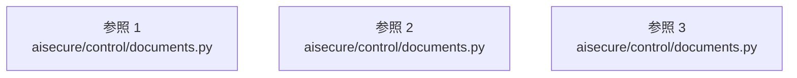

# dependency-map/n-aisecure-control-documents-py-4de277

[解析トップへ戻る](../../README.md)

確認済みファイル: `aisecure/control/documents.py`

解析: Python AST。静的なimport／export参照です。関数の実行順序やHTTP通信は表していません。

宣言: `Inspection`, `Builder`, `failure`, `_office`, `_pdf`, `inspect_bytes`, `_run_bounded`, `inspect`, `Scanner`

- `__future__` → 外部・標準ライブラリ・別名など。ローカル対応先は未確定
- `base64` → 外部・標準ライブラリ・別名など。ローカル対応先は未確定
- `dataclasses` → 外部・標準ライブラリ・別名など。ローカル対応先は未確定
- `io` → 外部・標準ライブラリ・別名など。ローカル対応先は未確定
- `os` → 外部・標準ライブラリ・別名など。ローカル対応先は未確定
- `pathlib` → 外部・標準ライブラリ・別名など。ローカル対応先は未確定
- `re` → 外部・標準ライブラリ・別名など。ローカル対応先は未確定
- `subprocess` → 外部・標準ライブラリ・別名など。ローカル対応先は未確定
- `sys` → 外部・標準ライブラリ・別名など。ローカル対応先は未確定
- `unicodedata` → 外部・標準ライブラリ・別名など。ローカル対応先は未確定
- `zipfile` → 外部・標準ライブラリ・別名など。ローカル対応先は未確定
- `defusedxml` → 外部・標準ライブラリ・別名など。ローカル対応先は未確定
- `common` → `aisecure/control/common.py`（内容確認済み）
- `preflight` → `aisecure/preflight.py`（一覧確認・内容未読）
- `pypdf` → 外部・標準ライブラリ・別名など。ローカル対応先は未確定
- `pypdf.generic` → 外部・標準ライブラリ・別名など。ローカル対応先は未確定
- `threading` → 外部・標準ライブラリ・別名など。ローカル対応先は未確定
- `signal` → 外部・標準ライブラリ・別名など。ローカル対応先は未確定
- `secrets` → 外部・標準ライブラリ・別名など。ローカル対応先は未確定

## 要素の説明

### imports-1

import参照の表示用グループ。

[詳細な図と説明を見る](imports-1/README.md)

### imports-2

import参照の表示用グループ。

[詳細な図と説明を見る](imports-2/README.md)

### imports-3

import参照の表示用グループ。

[詳細な図と説明を見る](imports-3/README.md)

