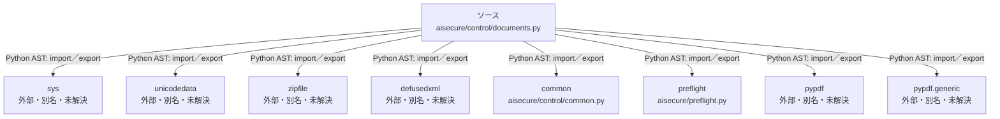

# dependency-map/n-aisecure-control-documents-py-4de277/imports-2

[解析トップへ戻る](../../../README.md)

import参照の表示用グループ。

## 要素の説明

### n-common-94c8c2

参照名: `common`

対応する実在ソース: `aisecure/control/common.py`。内容確認済み。

### n-defusedxml-3125fe

参照名: `defusedxml`

ローカルのソース対応先を確定できませんでした。外部ライブラリ、標準ライブラリ、型別名などを区別する追加確認が必要です。

### n-preflight-b648df

参照名: `preflight`

対応する実在ソース: `aisecure/preflight.py`。内容は未読。

### n-pypdf-0c2382

参照名: `pypdf`

ローカルのソース対応先を確定できませんでした。外部ライブラリ、標準ライブラリ、型別名などを区別する追加確認が必要です。

### n-pypdf-generic-4efbfc

参照名: `pypdf.generic`

ローカルのソース対応先を確定できませんでした。外部ライブラリ、標準ライブラリ、型別名などを区別する追加確認が必要です。

### n-sys-b4c56e

参照名: `sys`

ローカルのソース対応先を確定できませんでした。外部ライブラリ、標準ライブラリ、型別名などを区別する追加確認が必要です。

### n-unicodedata-61e641

参照名: `unicodedata`

ローカルのソース対応先を確定できませんでした。外部ライブラリ、標準ライブラリ、型別名などを区別する追加確認が必要です。

### n-zipfile-fabc0a

参照名: `zipfile`

ローカルのソース対応先を確定できませんでした。外部ライブラリ、標準ライブラリ、型別名などを区別する追加確認が必要です。

### source

`aisecure/control/documents.py` の内容を確認しました。

