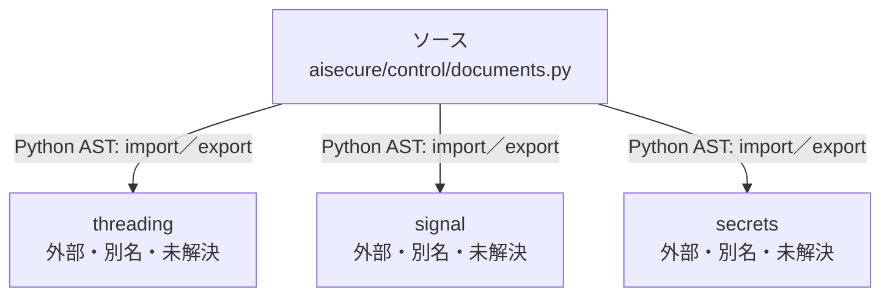

# dependency-map/n-aisecure-control-documents-py-4de277/imports-3

[解析トップへ戻る](../../../README.md)

import参照の表示用グループ。

## 要素の説明

### n-secrets-fe8655

参照名: `secrets`

ローカルのソース対応先を確定できませんでした。外部ライブラリ、標準ライブラリ、型別名などを区別する追加確認が必要です。

### n-signal-36ab4a

参照名: `signal`

ローカルのソース対応先を確定できませんでした。外部ライブラリ、標準ライブラリ、型別名などを区別する追加確認が必要です。

### n-threading-c3015a

参照名: `threading`

ローカルのソース対応先を確定できませんでした。外部ライブラリ、標準ライブラリ、型別名などを区別する追加確認が必要です。

### source

`aisecure/control/documents.py` の内容を確認しました。

