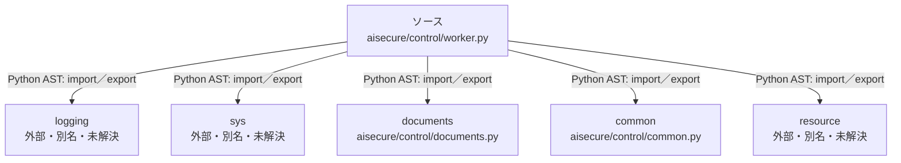

# dependency-map/n-aisecure-control-worker-py-c8c777

[解析トップへ戻る](../../README.md)

確認済みファイル: `aisecure/control/worker.py`

解析: Python AST。静的なimport／export参照です。関数の実行順序やHTTP通信は表していません。

宣言: `main`

- `logging` → 外部・標準ライブラリ・別名など。ローカル対応先は未確定
- `sys` → 外部・標準ライブラリ・別名など。ローカル対応先は未確定
- `documents` → `aisecure/control/documents.py`（内容確認済み）
- `common` → `aisecure/control/common.py`（内容確認済み）
- `resource` → 外部・標準ライブラリ・別名など。ローカル対応先は未確定

## 要素の説明

### n-common-94c8c2

参照名: `common`

対応する実在ソース: `aisecure/control/common.py`。内容確認済み。

### n-documents-ec9666

参照名: `documents`

対応する実在ソース: `aisecure/control/documents.py`。内容確認済み。

### n-logging-42f7b0

参照名: `logging`

ローカルのソース対応先を確定できませんでした。外部ライブラリ、標準ライブラリ、型別名などを区別する追加確認が必要です。

### n-resource-7a1047

参照名: `resource`

ローカルのソース対応先を確定できませんでした。外部ライブラリ、標準ライブラリ、型別名などを区別する追加確認が必要です。

### n-sys-b4c56e

参照名: `sys`

ローカルのソース対応先を確定できませんでした。外部ライブラリ、標準ライブラリ、型別名などを区別する追加確認が必要です。

### source

`aisecure/control/worker.py` の内容を確認しました。

