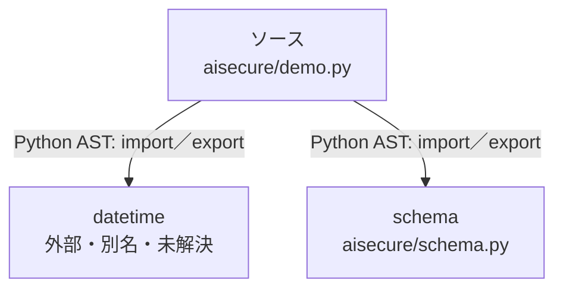

# dependency-map/n-aisecure-demo-py-124cfc

[解析トップへ戻る](../../README.md)

確認済みファイル: `aisecure/demo.py`

解析: Python AST。静的なimport／export参照です。関数の実行順序やHTTP通信は表していません。

宣言: `sample`

- `datetime` → 外部・標準ライブラリ・別名など。ローカル対応先は未確定
- `schema` → `aisecure/schema.py`（内容確認済み）

## 要素の説明

### n-datetime-89ffad

参照名: `datetime`

ローカルのソース対応先を確定できませんでした。外部ライブラリ、標準ライブラリ、型別名などを区別する追加確認が必要です。

### n-schema-fe7042

参照名: `schema`

対応する実在ソース: `aisecure/schema.py`。内容確認済み。

### source

`aisecure/demo.py` の内容を確認しました。

