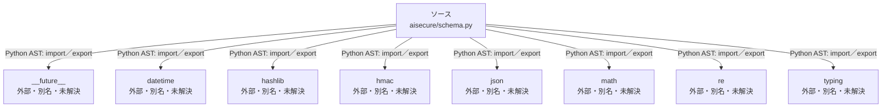

# dependency-map/n-aisecure-schema-py-b017a2

[解析トップへ戻る](../../README.md)

確認済みファイル: `aisecure/schema.py`

解析: Python AST。静的なimport／export参照です。関数の実行順序やHTTP通信は表していません。

宣言: `ValidationError`, `canonical`, `parse_time`, `iso`, `utcnow`, `object_keys`, `identifier`, `nullable_bool`, `pseudonym`, `number`, `provenance`, `read_json`, `normalize`

- `__future__` → 外部・標準ライブラリ・別名など。ローカル対応先は未確定
- `datetime` → 外部・標準ライブラリ・別名など。ローカル対応先は未確定
- `hashlib` → 外部・標準ライブラリ・別名など。ローカル対応先は未確定
- `hmac` → 外部・標準ライブラリ・別名など。ローカル対応先は未確定
- `json` → 外部・標準ライブラリ・別名など。ローカル対応先は未確定
- `math` → 外部・標準ライブラリ・別名など。ローカル対応先は未確定
- `re` → 外部・標準ライブラリ・別名など。ローカル対応先は未確定
- `typing` → 外部・標準ライブラリ・別名など。ローカル対応先は未確定

## 要素の説明

### n-datetime-89ffad

参照名: `datetime`

ローカルのソース対応先を確定できませんでした。外部ライブラリ、標準ライブラリ、型別名などを区別する追加確認が必要です。

### n-future-05a733

参照名: `__future__`

ローカルのソース対応先を確定できませんでした。外部ライブラリ、標準ライブラリ、型別名などを区別する追加確認が必要です。

### n-hashlib-7616ac

参照名: `hashlib`

ローカルのソース対応先を確定できませんでした。外部ライブラリ、標準ライブラリ、型別名などを区別する追加確認が必要です。

### n-hmac-f7ae92

参照名: `hmac`

ローカルのソース対応先を確定できませんでした。外部ライブラリ、標準ライブラリ、型別名などを区別する追加確認が必要です。

### n-json-05d97e

参照名: `json`

ローカルのソース対応先を確定できませんでした。外部ライブラリ、標準ライブラリ、型別名などを区別する追加確認が必要です。

### n-math-7a4883

参照名: `math`

ローカルのソース対応先を確定できませんでした。外部ライブラリ、標準ライブラリ、型別名などを区別する追加確認が必要です。

### n-re-c387c9

参照名: `re`

ローカルのソース対応先を確定できませんでした。外部ライブラリ、標準ライブラリ、型別名などを区別する追加確認が必要です。

### n-typing-02d7d3

参照名: `typing`

ローカルのソース対応先を確定できませんでした。外部ライブラリ、標準ライブラリ、型別名などを区別する追加確認が必要です。

### source

`aisecure/schema.py` の内容を確認しました。

