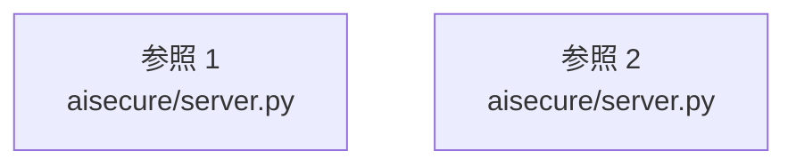

# dependency-map/n-aisecure-server-py-f7be25

[解析トップへ戻る](../../README.md)

確認済みファイル: `aisecure/server.py`

解析: Python AST。静的なimport／export参照です。関数の実行順序やHTTP通信は表していません。

宣言: `LocalServer`, `Handler`

- `__future__` → 外部・標準ライブラリ・別名など。ローカル対応先は未確定
- `http.server` → 外部・標準ライブラリ・別名など。ローカル対応先は未確定
- `hmac` → 外部・標準ライブラリ・別名など。ローカル対応先は未確定
- `json` → 外部・標準ライブラリ・別名など。ローカル対応先は未確定
- `pathlib` → 外部・標準ライブラリ・別名など。ローカル対応先は未確定
- `secrets` → 外部・標準ライブラリ・別名など。ローカル対応先は未確定
- `threading` → 外部・標準ライブラリ・別名など。ローカル対応先は未確定
- `time` → 外部・標準ライブラリ・別名など。ローカル対応先は未確定
- `urllib.parse` → 外部・標準ライブラリ・別名など。ローカル対応先は未確定
- `schema` → `aisecure/schema.py`（内容確認済み）
- `store` → `aisecure/store.py`（内容確認済み）
- `demo` → `aisecure/demo.py`（内容確認済み）
- `explain` → `aisecure/explain.py`（内容確認済み）

## 要素の説明

### imports-1

import参照の表示用グループ。

[詳細な図と説明を見る](imports-1/README.md)

### imports-2

import参照の表示用グループ。

[詳細な図と説明を見る](imports-2/README.md)

