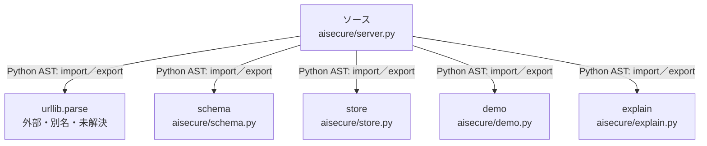

# dependency-map/n-aisecure-server-py-f7be25/imports-2

[解析トップへ戻る](../../../README.md)

import参照の表示用グループ。

## 要素の説明

### n-demo-89e495

参照名: `demo`

対応する実在ソース: `aisecure/demo.py`。内容確認済み。

### n-explain-f7c138

参照名: `explain`

対応する実在ソース: `aisecure/explain.py`。内容確認済み。

### n-schema-fe7042

参照名: `schema`

対応する実在ソース: `aisecure/schema.py`。内容確認済み。

### n-store-3a2129

参照名: `store`

対応する実在ソース: `aisecure/store.py`。内容確認済み。

### n-urllib-parse-ab9b2d

参照名: `urllib.parse`

ローカルのソース対応先を確定できませんでした。外部ライブラリ、標準ライブラリ、型別名などを区別する追加確認が必要です。

### source

`aisecure/server.py` の内容を確認しました。

