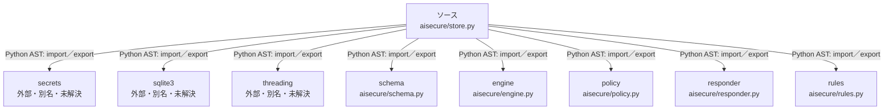

# dependency-map/n-aisecure-store-py-8cd38d/imports-2

[解析トップへ戻る](../../../README.md)

import参照の表示用グループ。

## 要素の説明

### n-engine-c64033

参照名: `engine`

対応する実在ソース: `aisecure/engine.py`。内容は未読。

### n-policy-9f00fa

参照名: `policy`

対応する実在ソース: `aisecure/policy.py`。内容は未読。

### n-responder-826822

参照名: `responder`

対応する実在ソース: `aisecure/responder.py`。内容は未読。

### n-rules-caa155

参照名: `rules`

対応する実在ソース: `aisecure/rules.py`。内容は未読。

### n-schema-fe7042

参照名: `schema`

対応する実在ソース: `aisecure/schema.py`。内容確認済み。

### n-secrets-fe8655

参照名: `secrets`

ローカルのソース対応先を確定できませんでした。外部ライブラリ、標準ライブラリ、型別名などを区別する追加確認が必要です。

### n-sqlite3-b54e39

参照名: `sqlite3`

ローカルのソース対応先を確定できませんでした。外部ライブラリ、標準ライブラリ、型別名などを区別する追加確認が必要です。

### n-threading-c3015a

参照名: `threading`

ローカルのソース対応先を確定できませんでした。外部ライブラリ、標準ライブラリ、型別名などを区別する追加確認が必要です。

### source

`aisecure/store.py` の内容を確認しました。

