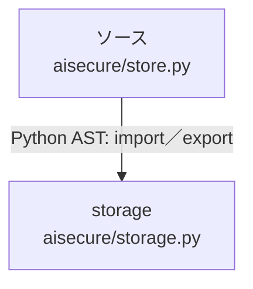

# dependency-map/n-aisecure-store-py-8cd38d/imports-3

[解析トップへ戻る](../../../README.md)

import参照の表示用グループ。

## 要素の説明

### n-storage-3d4829

参照名: `storage`

対応する実在ソース: `aisecure/storage.py`。内容は未読。

### source

`aisecure/store.py` の内容を確認しました。

