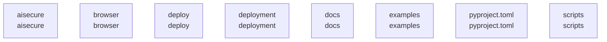

# overall-architecture/group-1

[解析トップへ戻る](../../README.md)

このグループは表示用の区切りです。独立した実行モジュールではありません。

## 要素の説明

### n-aisecure-02fec8

確認したパス: `aisecure`。配下の登録ファイルは65件。

- `aisecure/__init__.py`（一覧のみ）
- `aisecure/__main__.py`（一覧のみ）
- `aisecure/approvals.py`（一覧のみ）
- `aisecure/audit_sink.py`（一覧のみ）
- `aisecure/baseline.py`（一覧のみ）
- `aisecure/connectors/__init__.py`（一覧のみ）
- `aisecure/connectors/importer.py`（一覧のみ）
- `aisecure/connectors/profile.py`（一覧のみ）
- `aisecure/connectors/profiles/generic-asset-csv.json`（一覧のみ）
- `aisecure/connectors/profiles/generic-auth-csv.json`（一覧のみ）
- `aisecure/connectors/profiles/generic-file-access-jsonl.json`（一覧のみ）
- `aisecure/connectors/profiles/okta-system-log-jsonl.json`（一覧のみ）
- `aisecure/connectors/profiles/windows-security-logon-csv.json`（一覧のみ）
- `aisecure/control/__init__.py`（一覧のみ）
- `aisecure/control/__main__.py`（一覧のみ）
- `aisecure/control/admin.py`（一覧のみ）
- `aisecure/control/analytics.py`（一覧のみ）
- `aisecure/control/audit.py`（一覧のみ）
- `aisecure/control/bundles.py`（一覧のみ）
- `aisecure/control/common.py`（内容確認済み）
- `aisecure/control/documents.py`（内容確認済み）
- `aisecure/control/events.py`（一覧のみ）
- `aisecure/control/example_document.py`（一覧のみ）
- `aisecure/control/inspect_file.py`（一覧のみ）
- `aisecure/control/inspection.py`（一覧のみ）
- `aisecure/control/native.py`（一覧のみ）
- `aisecure/control/response.py`（一覧のみ）
- `aisecure/control/samples.py`（一覧のみ）
- `aisecure/control/schemas/bundle-report-v1.json`（一覧のみ）
- `aisecure/control/schemas/document-report-v1.json`（一覧のみ）
- `aisecure/control/service.py`（一覧のみ）
- `aisecure/control/vpn.py`（一覧のみ）
- `aisecure/control/web/app.css`（一覧のみ）
- `aisecure/control/web/app.js`（一覧のみ）
- `aisecure/control/web/index.html`（一覧のみ）

[詳細な図と説明を見る](n-aisecure-02fec8/README.md)

### n-browser-ef9836

確認したパス: `browser`。配下の登録ファイルは12件。

- `browser/aisecure/background.js`（一覧のみ）
- `browser/aisecure/content.js`（一覧のみ）
- `browser/aisecure/enforce.js`（一覧のみ）
- `browser/aisecure/enforce.test.js`（一覧のみ）
- `browser/aisecure/inject.js`（一覧のみ）
- `browser/aisecure/manifest.json`（一覧のみ）
- `browser/aisecure/package.json`（内容確認済み）
- `browser/aisecure/popup.css`（一覧のみ）
- `browser/aisecure/popup.html`（一覧のみ）
- `browser/aisecure/popup.js`（一覧のみ）
- `browser/aisecure/protocol.js`（一覧のみ）
- `browser/aisecure/protocol.test.js`（一覧のみ）

### n-deploy-b0d51b

確認したパス: `deploy`。配下の登録ファイルは1件。

- `deploy/control/Containerfile`（一覧のみ）

### n-deployment-7233fb

確認したパス: `deployment`。配下の登録ファイルは2件。

- `deployment/Dockerfile`（一覧のみ）
- `deployment/check-egress.sh`（一覧のみ）

### n-docs-71ab8b

確認したパス: `docs`。配下の登録ファイルは256件。

- `docs/.nojekyll`（一覧のみ）
- `docs/APPROVALS.md`（一覧のみ）
- `docs/AUDIT_SINK.md`（一覧のみ）
- `docs/CONNECTORS.md`（一覧のみ）
- `docs/FIRST_PROOF.md`（一覧のみ）
- `docs/INPUT_SCHEMA.md`（一覧のみ）
- `docs/LAUNCH_KIT.md`（一覧のみ）
- `docs/METRICS.md`（一覧のみ）
- `docs/OKTA.md`（一覧のみ）
- `docs/PREVENTION_BOUNDARY.ja.md`（一覧のみ）
- `docs/PRODUCT_SPEC.md`（一覧のみ）
- `docs/RESPONDER.md`（一覧のみ）
- `docs/SCENARIOS.md`（一覧のみ）
- `docs/SECURITY_CHECKLIST.md`（一覧のみ）
- `docs/SECURITY_REVIEW.md`（一覧のみ）
- `docs/SOURCES.md`（一覧のみ）
- `docs/TEST_REPORT.md`（一覧のみ）
- `docs/TUNING.md`（一覧のみ）
- `docs/browser-check.json`（一覧のみ）
- `docs/case-evidence.json`（一覧のみ）
- `docs/case.css`（一覧のみ）
- `docs/case.js`（一覧のみ）
- `docs/evaluation/rules-identity-both.json`（一覧のみ）
- `docs/evaluation/synthetic-baseline-identity-both.md`（一覧のみ）
- `docs/evaluation/synthetic-baseline.md`（一覧のみ）
- `docs/evidence/README.md`（一覧のみ）
- `docs/evidence/enterprise-synthetic-20260913.json`（一覧のみ）
- `docs/home-refine.css`（一覧のみ）
- `docs/home.css`（一覧のみ）
- `docs/home.js`（一覧のみ）
- `docs/index.html`（一覧のみ）
- `docs/index.ja.html`（一覧のみ）
- `docs/media/demo-build.json`（一覧のみ）
- `docs/media/demo-desktop.mp4`（一覧のみ）
- `docs/media/demo-poster.jpg`（一覧のみ）

[詳細な図と説明を見る](n-docs-71ab8b/README.md)

### n-examples-99345c

確認したパス: `examples`。配下の登録ファイルは9件。

- `examples/control/inspect_document.py`（一覧のみ）
- `examples/logs/assets.csv`（一覧のみ）
- `examples/logs/auth.csv`（一覧のみ）
- `examples/logs/file-access.jsonl`（一覧のみ）
- `examples/logs/labels.json`（一覧のみ）
- `examples/logs/okta-system-log-sample.jsonl`（一覧のみ）
- `examples/logs/windows-security-sample.csv`（一覧のみ）
- `examples/make-example-logs.py`（一覧のみ）
- `examples/synthetic-snapshot.json`（一覧のみ）

[詳細な図と説明を見る](n-examples-99345c/README.md)

### n-pyproject-toml-5d07e7

確認したパス: `pyproject.toml`。配下の登録ファイルは1件。

- `pyproject.toml`（内容確認済み）

### n-scripts-16728d

確認したパス: `scripts`。配下の登録ファイルは1件。

- `scripts/enterprise_synthetic.py`（一覧のみ）

