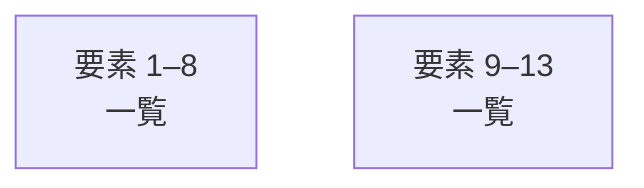

# overall-architecture/group-1/n-aisecure-02fec8

[解析トップへ戻る](../../../README.md)

確認したパス: `aisecure`。配下の登録ファイルは65件。

- `aisecure/__init__.py`（一覧のみ）
- `aisecure/__main__.py`（一覧のみ）
- `aisecure/approvals.py`（一覧のみ）
- `aisecure/audit_sink.py`（一覧のみ）
- `aisecure/baseline.py`（一覧のみ）
- `aisecure/connectors/__init__.py`（一覧のみ）
- `aisecure/connectors/importer.py`（一覧のみ）
- `aisecure/connectors/profile.py`（一覧のみ）
- `aisecure/connectors/profiles/generic-asset-csv.json`（一覧のみ）
- `aisecure/connectors/profiles/generic-auth-csv.json`（一覧のみ）
- `aisecure/connectors/profiles/generic-file-access-jsonl.json`（一覧のみ）
- `aisecure/connectors/profiles/okta-system-log-jsonl.json`（一覧のみ）
- `aisecure/connectors/profiles/windows-security-logon-csv.json`（一覧のみ）
- `aisecure/control/__init__.py`（一覧のみ）
- `aisecure/control/__main__.py`（一覧のみ）
- `aisecure/control/admin.py`（一覧のみ）
- `aisecure/control/analytics.py`（一覧のみ）
- `aisecure/control/audit.py`（一覧のみ）
- `aisecure/control/bundles.py`（一覧のみ）
- `aisecure/control/common.py`（内容確認済み）
- `aisecure/control/documents.py`（内容確認済み）
- `aisecure/control/events.py`（一覧のみ）
- `aisecure/control/example_document.py`（一覧のみ）
- `aisecure/control/inspect_file.py`（一覧のみ）
- `aisecure/control/inspection.py`（一覧のみ）
- `aisecure/control/native.py`（一覧のみ）
- `aisecure/control/response.py`（一覧のみ）
- `aisecure/control/samples.py`（一覧のみ）
- `aisecure/control/schemas/bundle-report-v1.json`（一覧のみ）
- `aisecure/control/schemas/document-report-v1.json`（一覧のみ）
- `aisecure/control/service.py`（一覧のみ）
- `aisecure/control/vpn.py`（一覧のみ）
- `aisecure/control/web/app.css`（一覧のみ）
- `aisecure/control/web/app.js`（一覧のみ）
- `aisecure/control/web/index.html`（一覧のみ）

## 要素の説明

### group-1

このグループは表示用の区切りです。独立した実行モジュールではありません。

[詳細な図と説明を見る](group-1/README.md)

### group-2

このグループは表示用の区切りです。独立した実行モジュールではありません。

[詳細な図と説明を見る](group-2/README.md)

