# overall-architecture/group-1/n-aisecure-02fec8/group-1

[解析トップへ戻る](../../../../README.md)

このグループは表示用の区切りです。独立した実行モジュールではありません。

```mermaid
graph TD
    n-aisecure-connectors-a9084e["connectors\naisecure/connectors"]
    n-aisecure-control-673ca0["control\naisecure/control"]
    n-aisecure-legacy-web-012b00["legacy_web\naisecure/legacy_web"]
    n-aisecure-providers-b938e8["providers\naisecure/providers"]
    n-aisecure-workbench-web-dff821["workbench_web\naisecure/workbench_web"]
    n-aisecure-init-py-0a6f15["__init__.py\naisecure/__init__.py"]
    n-aisecure-main-py-2643e0["__main__.py\naisecure/__main__.py"]
    n-aisecure-approvals-py-f54309["approvals.py\naisecure/approvals.py"]
```

## 要素の説明

### n-aisecure-approvals-py-f54309

実在パス: `aisecure/approvals.py`。1ファイル。

- `aisecure/approvals.py`

### n-aisecure-connectors-a9084e

実在パス: `aisecure/connectors`。8ファイル。

- `aisecure/connectors/__init__.py`
- `aisecure/connectors/importer.py`
- `aisecure/connectors/profile.py`
- `aisecure/connectors/profiles/generic-asset-csv.json`
- `aisecure/connectors/profiles/generic-auth-csv.json`
- `aisecure/connectors/profiles/generic-file-access-jsonl.json`
- `aisecure/connectors/profiles/okta-system-log-jsonl.json`
- `aisecure/connectors/profiles/windows-security-logon-csv.json`

### n-aisecure-control-673ca0

実在パス: `aisecure/control`。23ファイル。

- `aisecure/control/__init__.py`
- `aisecure/control/__main__.py`
- `aisecure/control/admin.py`
- `aisecure/control/analytics.py`
- `aisecure/control/audit.py`
- `aisecure/control/bundles.py`
- `aisecure/control/common.py`
- `aisecure/control/documents.py`
- `aisecure/control/events.py`
- `aisecure/control/example_document.py`
- `aisecure/control/inspect_file.py`
- `aisecure/control/inspection.py`
- `aisecure/control/native.py`
- `aisecure/control/response.py`
- `aisecure/control/samples.py`
- `aisecure/control/schemas/bundle-report-v1.json`
- `aisecure/control/schemas/document-report-v1.json`
- `aisecure/control/service.py`
- `aisecure/control/vpn.py`
- `aisecure/control/web/app.css`
- `aisecure/control/web/app.js`
- `aisecure/control/web/index.html`
- `aisecure/control/worker.py`

### n-aisecure-init-py-0a6f15

実在パス: `aisecure/__init__.py`。1ファイル。

- `aisecure/__init__.py`

### n-aisecure-legacy-web-012b00

実在パス: `aisecure/legacy_web`。5ファイル。

- `aisecure/legacy_web/app.js`
- `aisecure/legacy_web/i18n.js`
- `aisecure/legacy_web/index.html`
- `aisecure/legacy_web/quiet-cinema.css`
- `aisecure/legacy_web/style.css`

### n-aisecure-main-py-2643e0

実在パス: `aisecure/__main__.py`。1ファイル。

- `aisecure/__main__.py`

### n-aisecure-providers-b938e8

実在パス: `aisecure/providers`。3ファイル。

- `aisecure/providers/__init__.py`
- `aisecure/providers/fortios_inventory.py`
- `aisecure/providers/okta.py`

### n-aisecure-workbench-web-dff821

実在パス: `aisecure/workbench_web`。3ファイル。

- `aisecure/workbench_web/app.css`
- `aisecure/workbench_web/app.js`
- `aisecure/workbench_web/index.html`

