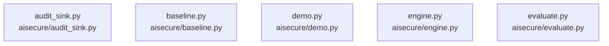

# overall-architecture/group-1/n-aisecure-02fec8/group-2

[解析トップへ戻る](../../../../README.md)

このグループは表示用の区切りです。独立した実行モジュールではありません。

## 要素の説明

### n-aisecure-audit-sink-py-5d8278

実在パス: `aisecure/audit_sink.py`。1ファイル。

- `aisecure/audit_sink.py`

### n-aisecure-baseline-py-cf7d6d

実在パス: `aisecure/baseline.py`。1ファイル。

- `aisecure/baseline.py`

### n-aisecure-demo-py-124cfc

実在パス: `aisecure/demo.py`。1ファイル。

- `aisecure/demo.py`

### n-aisecure-engine-py-f00103

実在パス: `aisecure/engine.py`。1ファイル。

- `aisecure/engine.py`

### n-aisecure-evaluate-py-29d8ff

実在パス: `aisecure/evaluate.py`。1ファイル。

- `aisecure/evaluate.py`

