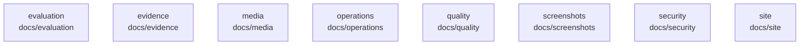

# overall-architecture/group-1/n-docs-71ab8b/group-1

[解析トップへ戻る](../../../../README.md)

このグループは表示用の区切りです。独立した実行モジュールではありません。

## 要素の説明

### n-docs-evaluation-281bf8

実在パス: `docs/evaluation`。3ファイル。

- `docs/evaluation/rules-identity-both.json`
- `docs/evaluation/synthetic-baseline-identity-both.md`
- `docs/evaluation/synthetic-baseline.md`

### n-docs-evidence-3d7bf7

実在パス: `docs/evidence`。2ファイル。

- `docs/evidence/README.md`
- `docs/evidence/enterprise-synthetic-20260913.json`

### n-docs-media-17908a

実在パス: `docs/media`。32ファイル。

- `docs/media/demo-build.json`
- `docs/media/demo-desktop.mp4`
- `docs/media/demo-poster.jpg`
- `docs/media/demo-raw/marks.json`
- `docs/media/demo-raw/raw.webm`
- `docs/media/demo-raw/report.json`
- `docs/media/demo-vertical.mp4`
- `docs/media/demo.gif`
- `docs/media/demo.mp4`
- `docs/media/intro-ja.mp4`
- `docs/media/intro-narrated-ja.mp4`
- `docs/media/intro-narrated.mp4`
- `docs/media/intro-poster-ja.png`
- `docs/media/intro-poster.png`
- `docs/media/intro.mp4`
- `docs/media/launch-kit/aisecure-film-poster.jpg`
- `docs/media/launch-kit/aisecure-film-vertical.mp4`
- `docs/media/launch-kit/aisecure-film.mp4`
- `docs/media/launch-kit/aisecure-film.srt`
- `docs/media/launch-kit/aisecure-launch-kit.zip`
- `docs/media/product-film-en-poster.jpg`
- `docs/media/product-film-en.mp4`
- `docs/media/product-film-en.vtt`
- `docs/media/product-film-ja-poster.jpg`
- `docs/media/product-film-ja.mp4`

### n-docs-operations-8f703d

実在パス: `docs/operations`。10ファイル。

- `docs/operations/BROWSER_ENFORCEMENT.md`
- `docs/operations/CONTROL_ALPHA.md`
- `docs/operations/CONTROL_SCOPE.md`
- `docs/operations/CONTROL_VALIDATION.json`
- `docs/operations/DOCUMENT_CONTRACT.md`
- `docs/operations/EVALUATION_ENGAGEMENT.md`
- `docs/operations/RUNBOOK.md`
- `docs/operations/TASK_MATRIX.md`
- `docs/operations/WORKBENCH.md`
- `docs/operations/validation.example.json`

### n-docs-quality-8a58ae

実在パス: `docs/quality`。143ファイル。

- `docs/quality/acceptance.md`
- `docs/quality/claims.md`
- `docs/quality/evidence/2026-09-19-skill-review/browser-harness-cleanup-failure.json`
- `docs/quality/evidence/2026-09-19-skill-review/browser-round1-failure.json`
- `docs/quality/evidence/2026-09-19-skill-review/browser.json`
- `docs/quality/evidence/2026-09-19-skill-review/browser.log`
- `docs/quality/evidence/2026-09-19-skill-review/cold-install-probe.py`
- `docs/quality/evidence/2026-09-19-skill-review/cold-install.json`
- `docs/quality/evidence/2026-09-19-skill-review/cold-install.log`
- `docs/quality/evidence/2026-09-19-skill-review/commands.json`
- `docs/quality/evidence/2026-09-19-skill-review/control-1440-css-200.png`
- `docs/quality/evidence/2026-09-19-skill-review/control-1440.png`
- `docs/quality/evidence/2026-09-19-skill-review/control-360-css-200.png`
- `docs/quality/evidence/2026-09-19-skill-review/control-360.png`
- `docs/quality/evidence/2026-09-19-skill-review/control-390-css-200.png`
- `docs/quality/evidence/2026-09-19-skill-review/control-390.png`
- `docs/quality/evidence/2026-09-19-skill-review/control-768-css-200.png`
- `docs/quality/evidence/2026-09-19-skill-review/control-768.png`
- `docs/quality/evidence/2026-09-19-skill-review/dependency-free.log`
- `docs/quality/evidence/2026-09-19-skill-review/diff-check.log`
- `docs/quality/evidence/2026-09-19-skill-review/error-1440.png`
- `docs/quality/evidence/2026-09-19-skill-review/error-360.png`
- `docs/quality/evidence/2026-09-19-skill-review/error-390.png`
- `docs/quality/evidence/2026-09-19-skill-review/error-768.png`
- `docs/quality/evidence/2026-09-19-skill-review/full-tests.json`

### n-docs-screenshots-43be7c

実在パス: `docs/screenshots`。14ファイル。

- `docs/screenshots/about-mobile.png`
- `docs/screenshots/about.png`
- `docs/screenshots/assets-mobile.png`
- `docs/screenshots/assets.png`
- `docs/screenshots/audit-mobile.png`
- `docs/screenshots/audit.png`
- `docs/screenshots/overview-mobile.png`
- `docs/screenshots/overview.ja.png`
- `docs/screenshots/overview.png`
- `docs/screenshots/plans-mobile.png`
- `docs/screenshots/plans.png`
- `docs/screenshots/tuning-mobile.png`
- `docs/screenshots/tuning.ja.png`
- `docs/screenshots/tuning.png`

### n-docs-security-d04e3e

実在パス: `docs/security`。4ファイル。

- `docs/security/DETECTION_MEASUREMENT.md`
- `docs/security/THREAT_MODEL.md`
- `docs/security/corpus.jsonl`
- `docs/security/detection-measurement.json`

### n-docs-site-5e78da

実在パス: `docs/site`。10ファイル。

- `docs/site/ACCEPTANCE.md`
- `docs/site/CONTENT.md`
- `docs/site/DESIGN.md`
- `docs/site/PRESENTATION-20260916.md`
- `docs/site/PRODUCT.md`
- `docs/site/REVIEW-20260916.md`
- `docs/site/VIDEO.md`
- `docs/site/candidates/a.html`
- `docs/site/candidates/b.html`
- `docs/site/candidates/c.html`

