# overall-architecture/group-1/n-docs-71ab8b/group-2

[解析トップへ戻る](../../../../README.md)

このグループは表示用の区切りです。独立した実行モジュールではありません。

```mermaid
graph TD
    n-docs-browser-check-json-7719aa["browser-check.json\ndocs/browser-check.json"]
    n-docs-case-evidence-json-6d1b03["case-evidence.json\ndocs/case-evidence.json"]
    n-docs-case-js-d0ccc0["case.js\ndocs/case.js"]
    n-docs-home-js-4bde3f["home.js\ndocs/home.js"]
    n-docs-index-html-8c0d6b["index.html\ndocs/index.html"]
    n-docs-index-ja-html-28057b["index.ja.html\ndocs/index.ja.html"]
    n-docs-obsidian-js-efca1e["obsidian.js\ndocs/obsidian.js"]
    n-docs-portfolio-js-0de794["portfolio.js\ndocs/portfolio.js"]
```

## 要素の説明

### n-docs-browser-check-json-7719aa

実在パス: `docs/browser-check.json`。1ファイル。

- `docs/browser-check.json`

### n-docs-case-evidence-json-6d1b03

実在パス: `docs/case-evidence.json`。1ファイル。

- `docs/case-evidence.json`

### n-docs-case-js-d0ccc0

実在パス: `docs/case.js`。1ファイル。

- `docs/case.js`

### n-docs-home-js-4bde3f

実在パス: `docs/home.js`。1ファイル。

- `docs/home.js`

### n-docs-index-html-8c0d6b

実在パス: `docs/index.html`。1ファイル。

- `docs/index.html`

### n-docs-index-ja-html-28057b

実在パス: `docs/index.ja.html`。1ファイル。

- `docs/index.ja.html`

### n-docs-obsidian-js-efca1e

実在パス: `docs/obsidian.js`。1ファイル。

- `docs/obsidian.js`

### n-docs-portfolio-js-0de794

実在パス: `docs/portfolio.js`。1ファイル。

- `docs/portfolio.js`

