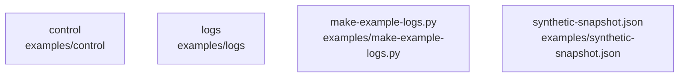

# overall-architecture/group-1/n-examples-99345c

[解析トップへ戻る](../../../README.md)

確認したパス: `examples`。配下の登録ファイルは9件。

- `examples/control/inspect_document.py`（一覧のみ）
- `examples/logs/assets.csv`（一覧のみ）
- `examples/logs/auth.csv`（一覧のみ）
- `examples/logs/file-access.jsonl`（一覧のみ）
- `examples/logs/labels.json`（一覧のみ）
- `examples/logs/okta-system-log-sample.jsonl`（一覧のみ）
- `examples/logs/windows-security-sample.csv`（一覧のみ）
- `examples/make-example-logs.py`（一覧のみ）
- `examples/synthetic-snapshot.json`（一覧のみ）

## 要素の説明

### n-examples-control-4381af

実在パス: `examples/control`。1ファイル。

- `examples/control/inspect_document.py`

### n-examples-logs-fcf360

実在パス: `examples/logs`。6ファイル。

- `examples/logs/assets.csv`
- `examples/logs/auth.csv`
- `examples/logs/file-access.jsonl`
- `examples/logs/labels.json`
- `examples/logs/okta-system-log-sample.jsonl`
- `examples/logs/windows-security-sample.csv`

### n-examples-make-example-logs-py-e8f804

実在パス: `examples/make-example-logs.py`。1ファイル。

- `examples/make-example-logs.py`

### n-examples-synthetic-snapshot-json-b798ef

実在パス: `examples/synthetic-snapshot.json`。1ファイル。

- `examples/synthetic-snapshot.json`

