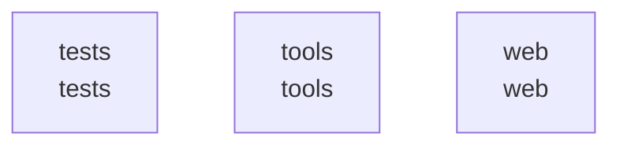

# overall-architecture/group-2

[解析トップへ戻る](../../README.md)

このグループは表示用の区切りです。独立した実行モジュールではありません。

## 要素の説明

### n-tests-04d13f

確認したパス: `tests`。配下の登録ファイルは32件。

- `tests/control/__init__.py`（一覧のみ）
- `tests/control/helpers.py`（一覧のみ）
- `tests/control/test_analytics.py`（一覧のみ）
- `tests/control/test_bundles.py`（一覧のみ）
- `tests/control/test_documents.py`（一覧のみ）
- `tests/control/test_http_receiver.py`（一覧のみ）
- `tests/control/test_inspection_contract.py`（一覧のみ）
- `tests/control/test_report_save.py`（一覧のみ）
- `tests/control/test_report_schema.py`（一覧のみ）
- `tests/control/test_response.py`（一覧のみ）
- `tests/control/test_service_native.py`（一覧のみ）
- `tests/test_approvals.py`（一覧のみ）
- `tests/test_audit_sink.py`（一覧のみ）
- `tests/test_cli.py`（一覧のみ）
- `tests/test_connectors.py`（一覧のみ）
- `tests/test_core.py`（一覧のみ）
- `tests/test_evaluate.py`（一覧のみ）
- `tests/test_fortios_inventory.py`（一覧のみ）
- `tests/test_fuzz.py`（一覧のみ）
- `tests/test_gateway.py`（一覧のみ）
- `tests/test_home_product_image.py`（一覧のみ）
- `tests/test_homepage.py`（一覧のみ）
- `tests/test_http.py`（一覧のみ）
- `tests/test_http_fuzz.py`（一覧のみ）
- `tests/test_monitor.py`（一覧のみ）
- `tests/test_okta.py`（一覧のみ）
- `tests/test_package_contract.py`（一覧のみ）
- `tests/test_preflight.py`（一覧のみ）
- `tests/test_product_presentation.py`（一覧のみ）
- `tests/test_responder.py`（一覧のみ）
- `tests/test_rules.py`（一覧のみ）
- `tests/test_storage.py`（一覧のみ）

[詳細な図と説明を見る](n-tests-04d13f/README.md)

### n-tools-0284c6

確認したパス: `tools`。配下の登録ファイルは25件。

- `tools/__init__.py`（一覧のみ）
- `tools/build_demo_video.py`（一覧のみ）
- `tools/build_release.py`（一覧のみ）
- `tools/capture.py`（一覧のみ）
- `tools/check_control.py`（一覧のみ）
- `tools/check_control_browser.cjs`（一覧のみ）
- `tools/check_control_package.py`（一覧のみ）
- `tools/check_product_presentation.py`（一覧のみ）
- `tools/check_workbench.py`（一覧のみ）
- `tools/dom-check.mjs`（一覧のみ）
- `tools/install_control_native.py`（一覧のみ）
- `tools/make-demo.py`（一覧のみ）
- `tools/make-intro.py`（一覧のみ）
- `tools/make-preview.py`（一覧のみ）
- `tools/make-screendemo.py`（一覧のみ）
- `tools/make_endcards.cjs`（一覧のみ）
- `tools/make_workbench_examples.py`（一覧のみ）
- `tools/measure_detection.py`（一覧のみ）
- `tools/network_boundary_lab.py`（一覧のみ）
- `tools/record_demo.cjs`（一覧のみ）
- `tools/release_gate.py`（一覧のみ）
- `tools/render_product_film.py`（一覧のみ）
- `tools/run_full_tests.py`（一覧のみ）
- `tools/split_corpus_literals.py`（一覧のみ）
- `tools/update_manifest.py`（一覧のみ）

[詳細な図と説明を見る](n-tools-0284c6/README.md)

### n-web-ca84d1

確認したパス: `web`。配下の登録ファイルは5件。

- `web/app.js`（一覧のみ）
- `web/i18n.js`（一覧のみ）
- `web/index.html`（一覧のみ）
- `web/quiet-cinema.css`（一覧のみ）
- `web/style.css`（一覧のみ）

[詳細な図と説明を見る](n-web-ca84d1/README.md)

