# overall-architecture/group-2/n-tests-04d13f/group-1

[解析トップへ戻る](../../../../README.md)

このグループは表示用の区切りです。独立した実行モジュールではありません。

```mermaid
graph TD
    n-tests-control-342ebc["control\ntests/control"]
    n-tests-test-approvals-py-0dfc0b["test_approvals.py\ntests/test_approvals.py"]
    n-tests-test-audit-sink-py-be40a5["test_audit_sink.py\ntests/test_audit_sink.py"]
    n-tests-test-cli-py-717725["test_cli.py\ntests/test_cli.py"]
    n-tests-test-connectors-py-633ac7["test_connectors.py\ntests/test_connectors.py"]
    n-tests-test-core-py-d2ea59["test_core.py\ntests/test_core.py"]
    n-tests-test-evaluate-py-9bcabf["test_evaluate.py\ntests/test_evaluate.py"]
    n-tests-test-fortios-inventory-py-a9a1bb["test_fortios_inventory.py\ntests/test_fortios_inventory.py"]
```

## 要素の説明

### n-tests-control-342ebc

実在パス: `tests/control`。11ファイル。

- `tests/control/__init__.py`
- `tests/control/helpers.py`
- `tests/control/test_analytics.py`
- `tests/control/test_bundles.py`
- `tests/control/test_documents.py`
- `tests/control/test_http_receiver.py`
- `tests/control/test_inspection_contract.py`
- `tests/control/test_report_save.py`
- `tests/control/test_report_schema.py`
- `tests/control/test_response.py`
- `tests/control/test_service_native.py`

### n-tests-test-approvals-py-0dfc0b

実在パス: `tests/test_approvals.py`。1ファイル。

- `tests/test_approvals.py`

### n-tests-test-audit-sink-py-be40a5

実在パス: `tests/test_audit_sink.py`。1ファイル。

- `tests/test_audit_sink.py`

### n-tests-test-cli-py-717725

実在パス: `tests/test_cli.py`。1ファイル。

- `tests/test_cli.py`

### n-tests-test-connectors-py-633ac7

実在パス: `tests/test_connectors.py`。1ファイル。

- `tests/test_connectors.py`

### n-tests-test-core-py-d2ea59

実在パス: `tests/test_core.py`。1ファイル。

- `tests/test_core.py`

### n-tests-test-evaluate-py-9bcabf

実在パス: `tests/test_evaluate.py`。1ファイル。

- `tests/test_evaluate.py`

### n-tests-test-fortios-inventory-py-a9a1bb

実在パス: `tests/test_fortios_inventory.py`。1ファイル。

- `tests/test_fortios_inventory.py`

