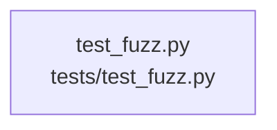

# overall-architecture/group-2/n-tests-04d13f/group-2

[解析トップへ戻る](../../../../README.md)

このグループは表示用の区切りです。独立した実行モジュールではありません。

## 要素の説明

### n-tests-test-fuzz-py-313df8

実在パス: `tests/test_fuzz.py`。1ファイル。

- `tests/test_fuzz.py`

