# overall-architecture/group-2/n-tools-0284c6

[解析トップへ戻る](../../../README.md)

確認したパス: `tools`。配下の登録ファイルは25件。

- `tools/__init__.py`（一覧のみ）
- `tools/build_demo_video.py`（一覧のみ）
- `tools/build_release.py`（一覧のみ）
- `tools/capture.py`（一覧のみ）
- `tools/check_control.py`（一覧のみ）
- `tools/check_control_browser.cjs`（一覧のみ）
- `tools/check_control_package.py`（一覧のみ）
- `tools/check_product_presentation.py`（一覧のみ）
- `tools/check_workbench.py`（一覧のみ）
- `tools/dom-check.mjs`（一覧のみ）
- `tools/install_control_native.py`（一覧のみ）
- `tools/make-demo.py`（一覧のみ）
- `tools/make-intro.py`（一覧のみ）
- `tools/make-preview.py`（一覧のみ）
- `tools/make-screendemo.py`（一覧のみ）
- `tools/make_endcards.cjs`（一覧のみ）
- `tools/make_workbench_examples.py`（一覧のみ）
- `tools/measure_detection.py`（一覧のみ）
- `tools/network_boundary_lab.py`（一覧のみ）
- `tools/record_demo.cjs`（一覧のみ）
- `tools/release_gate.py`（一覧のみ）
- `tools/render_product_film.py`（一覧のみ）
- `tools/run_full_tests.py`（一覧のみ）
- `tools/split_corpus_literals.py`（一覧のみ）
- `tools/update_manifest.py`（一覧のみ）

```mermaid
graph TD
    n-tools-init-py-6ae81e["__init__.py\ntools/__init__.py"]
    n-tools-build-demo-video-py-169656["build_demo_video.py\ntools/build_demo_video.py"]
    n-tools-build-release-py-27d2ed["build_release.py\ntools/build_release.py"]
    n-tools-capture-py-502756["capture.py\ntools/capture.py"]
    n-tools-check-control-py-5dbe3c["check_control.py\ntools/check_control.py"]
    n-tools-check-control-package-py-33d03b["check_control_package.py\ntools/check_control_package.py"]
    n-tools-check-product-presentation-py-5c112f["check_product_presentation.py\ntools/check_product_presentation.py"]
    n-tools-check-workbench-py-471bad["check_workbench.py\ntools/check_workbench.py"]
```

## 要素の説明

### n-tools-build-demo-video-py-169656

実在パス: `tools/build_demo_video.py`。1ファイル。

- `tools/build_demo_video.py`

### n-tools-build-release-py-27d2ed

実在パス: `tools/build_release.py`。1ファイル。

- `tools/build_release.py`

### n-tools-capture-py-502756

実在パス: `tools/capture.py`。1ファイル。

- `tools/capture.py`

### n-tools-check-control-package-py-33d03b

実在パス: `tools/check_control_package.py`。1ファイル。

- `tools/check_control_package.py`

### n-tools-check-control-py-5dbe3c

実在パス: `tools/check_control.py`。1ファイル。

- `tools/check_control.py`

### n-tools-check-product-presentation-py-5c112f

実在パス: `tools/check_product_presentation.py`。1ファイル。

- `tools/check_product_presentation.py`

### n-tools-check-workbench-py-471bad

実在パス: `tools/check_workbench.py`。1ファイル。

- `tools/check_workbench.py`

### n-tools-init-py-6ae81e

実在パス: `tools/__init__.py`。1ファイル。

- `tools/__init__.py`

