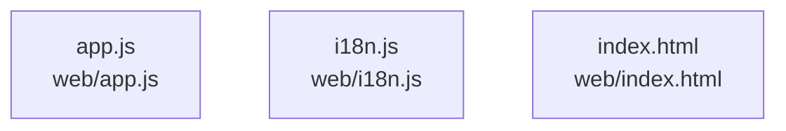

# overall-architecture/group-2/n-web-ca84d1

[解析トップへ戻る](../../../README.md)

確認したパス: `web`。配下の登録ファイルは5件。

- `web/app.js`（一覧のみ）
- `web/i18n.js`（一覧のみ）
- `web/index.html`（一覧のみ）
- `web/quiet-cinema.css`（一覧のみ）
- `web/style.css`（一覧のみ）

## 要素の説明

### n-web-app-js-e1f870

実在パス: `web/app.js`。1ファイル。

- `web/app.js`

### n-web-i18n-js-70bdbd

実在パス: `web/i18n.js`。1ファイル。

- `web/i18n.js`

### n-web-index-html-497670

実在パス: `web/index.html`。1ファイル。

- `web/index.html`

